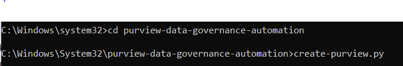

# 🚀 Creating a Microsoft Purview Account with Python SDK

This project demonstrates how to **programmatically create a Microsoft Purview account** using the **Python SDK**

---

## 📋 Prerequisites

Before running the script, ensure you have:

- An **Azure subscription**
- A **Service Principal** with Contributor/Owner role on the subscription
- The **Microsoft.Purview** resource provider registered
- Ensure the following details are availble during the account creation:
  - Tenant ID
  - Subscription ID
  - Service Principal Client ID
  - Service Principal Secret Value
  - Resource Group Name (existing or new)
  - Region (for both Resource Group and Purview account)

---

## 🛠️ Code Walkthrough

The script below creates Purview account:

```python
from traceback import print_tb
from azure.identity import ClientSecretCredential 
from azure.mgmt.resource import ResourceManagementClient
from azure.mgmt.purview import PurviewManagementClient
from azure.mgmt.purview.models import *
from datetime import datetime, timedelta
import time

def createpurview():
    print("Ensure prerequisites are met before proceeding...")

    Tid= input("Enter Tenant ID:")
    subscription_id = input("Enter Azure Subscription ID:")
    SPid = input("Enter Service Principals Application (client) ID:")
    SPsv = input("Enter Service Principals Secret value:")
    rg_name = input("Enter resource group name:")
    purview_name = input("Enter purview account name (It must be globally unique):")
    location = input("Enter region:") 

    # Authenticate
    credentials = ClientSecretCredential(client_id=SPid, client_secret=SPsv, tenant_id=Tid) 
    resource_client = ResourceManagementClient(credentials, subscription_id)
    purview_client = PurviewManagementClient(credentials, subscription_id)

    # Create resource group if not exists
    rg_list = [rg.name for rg in resource_client.resource_groups.list()]
    if rg_name not in rg_list:
        resource_client.resource_groups.create_or_update(rg_name, {"location": location})

    # Define Purview account properties
    identity = Identity(type="SystemAssigned")
    sku = AccountSku(name="Standard", capacity=4)
    purview_resource = Account(identity=identity, sku=sku, location=location)
       
    try:
        pa = purview_client.accounts.begin_create_or_update(rg_name, purview_name, purview_resource).result()
        print("✅ Purview account created successfully!")
        print("Location:", pa.location, "Name:", purview_name, "ID:", pa.id, "Tags:", pa.tags) 
    except Exception as e:
        print("❌ Error creating account:", e)
        print_tb(e)
 
    # Monitor provisioning state
    while getattr(pa, 'provisioning_state') != "Succeeded":
        pa = purview_client.accounts.get(rg_name, purview_name)  
        print("Provisioning state:", getattr(pa, 'provisioning_state'))
        if getattr(pa, 'provisioning_state') == "Failed":
            print("❌ Account creation failed")
            break
        time.sleep(30)    

# Run script
createpurview()
```

---

🧾 Input Prompts Overview
When you execute the script 'create-purview.py', you’ll be asked to enter the following details interactively:


- Tenant ID
- Azure Subscription ID
- Service Principal Client ID
- Service Principal Secret Value
- Resource Group Name
- Purview Account Name (must be globally unique)
- Region (e.g., eastus, westus2)

These inputs are used to authenticate, create the resource group (if needed), and provision the Purview account.

## 📊 Expected Results

When executed successfully, the script will:

- Create a **Resource Group** (if not already existing).
- Provision a **Microsoft Purview Account** with:
  - **System-assigned identity**
  - **Standard SKU (CU = 1)**
- Output details such as:
  - Location
  - Account Name
  - Account ID
  - Tags
- Continuously check the **provisioning state** until it reaches `Succeeded`.

Example output:

```
✅ Purview account created successfully!
Location: eastus  Name: mypurviewdemo  ID: /subscriptions/xxxx/resourceGroups/demo-rg/providers/Microsoft.Purview/accounts/mypurviewdemo  Tags: {}
Provisioning state: Succeeded

```
