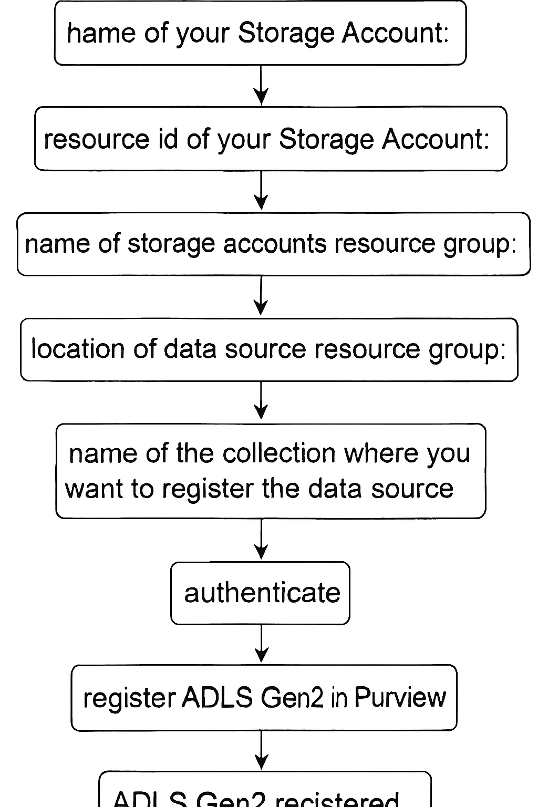

# 📘 Registering Azure Data Lake Storage Gen2 in Microsoft Purview

This module demonstrates how to **register an Azure Data Lake Storage Gen2 (ADLS Gen2) account** in the **Microsoft Purview Data Map** using the **Purview Python SDK**.

---

## 📋 Prerequisites

Before running the script, ensure you have:

- An **Azure account with an active subscription** (create one for free if needed).  
- An **active Microsoft Purview account**.  
- **Permissions**:
  - Service principal used to authenticate purview catalog must be a **Data Source Administrator** and **Data Reader** in Purview DataMap to register and manage data sources within that domain or collection.  
  - You need at least **Reader permission** on the ADLS Gen2 account to register it.  
  - See Microsoft Purview Permissions documentation for details.  
  - [Connect to Azure Data Lake Storage in Microsoft Purview](https://learn.microsoft.com/en-us/purview/register-scan-adls-gen2?tabs=MI#prerequisites)
---

## 🛠️ Script Overview

The script (`register_datasource.py`) performs the following:

1. Loads credentials via `authenticate.py` (Tenant ID, Client ID, Secret, Purview Account Name).  
2. Connects to the **Purview Catalog endpoint**.  
3. Prompts for ADLS Gen2 details:  

   ```python
   storage_name   = input("name of your Storage Account: ")
   storage_id     = input("resource id of your Storage Account: ")
   rg_name        = input("name of storage accounts resource group: ")
   rg_location    = input("location of data source resource group: ")
   collection_name= input("name of the collection where you want to register the data source: ")
   ds_name        = input("a friendly data source name: ")
   ```

4. Registers the ADLS Gen2 account as a **data source** in Purview.  
5. Prints confirmation or Error message(if failed to register).

---

## ▶️ Usage

Run the script:

```bash
python register_datasource.py
```

You’ll be prompted to enter the values listed above.  

---

## 📊 Example Output

```
✅ Data source {ds_name} successfully created or updated
Response: {
  "name": "friendly-datasource-name",
  "kind": "AzureDataLakeStorage",
  "properties": {
    "resourceId": "/subscriptions/xxxx/resourceGroups/demo-rg/providers/Microsoft.Storage/storageAccounts/mystorageaccount",
    "location": "eastus",
    "collection": "default"
  }
}
```
